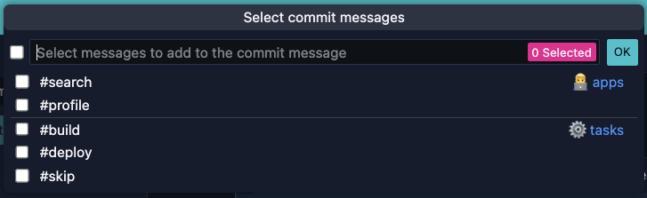
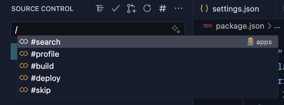

# CommitHelper for Visual Studio Code

Streamline your commit message process with **CommitHelper**! This extension allows you to create and manage a list of common commit messages or tags, making it effortless to insert them while you write.

## Use Case

Imagine you have a set of tags that you regularly use to control your CI/CD workflow, such as running specific tests, skipping deployments, or triggering particular pipelines. With **CommitHelper**, you can store these tags and easily select the appropriate one while composing your commit message. This not only saves time but also reduces the risk of errors by ensuring you consistently use the correct tags.

## Configuration

The extension requires you to configure the `commitHelper.messages` setting in your `settings.json` file.

Here is an example configuration:

```json
{
  "commitHelper.messages": [
    {
      "type": "👨‍💻 apps",
      "values": ["#search", "#profile"]
    },
    {
      "type": "⚙️ tasks",
      "values": ["#build", "#deploy", "#skip"]
    }
  ]
}
```

## Usage

once you have configured the `commitHelper.messages` setting, you can start using **CommitHelper** to insert your commit messages.

- Open the **source control** panel in Visual Studio Code.
- Click on the `#` icon to open the **CommitHelper** panel

<figure align="center">
  
  <figcaption>Quickpick list</figcaption>
</figure>

- Or start typing a slash `/` in the commit message input field.

<figure align="center">
  
  <figcaption>Completion list in SCM input</figcaption>
</figure>

- Select the desired tag from the list to insert it into your commit message.
